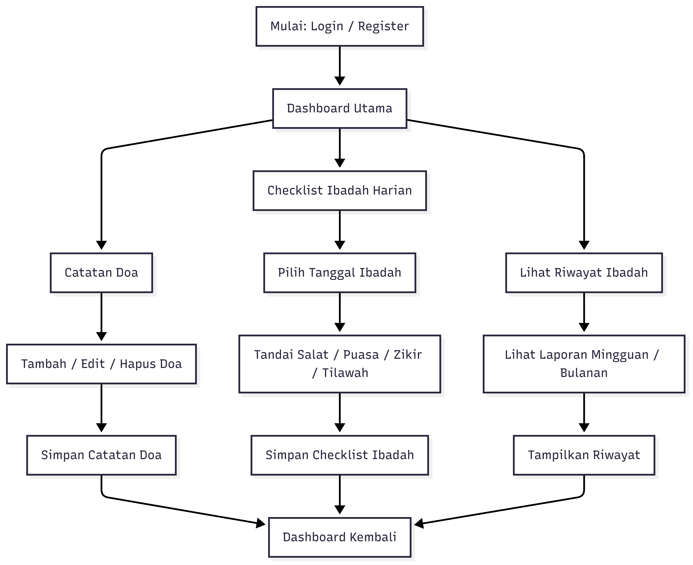
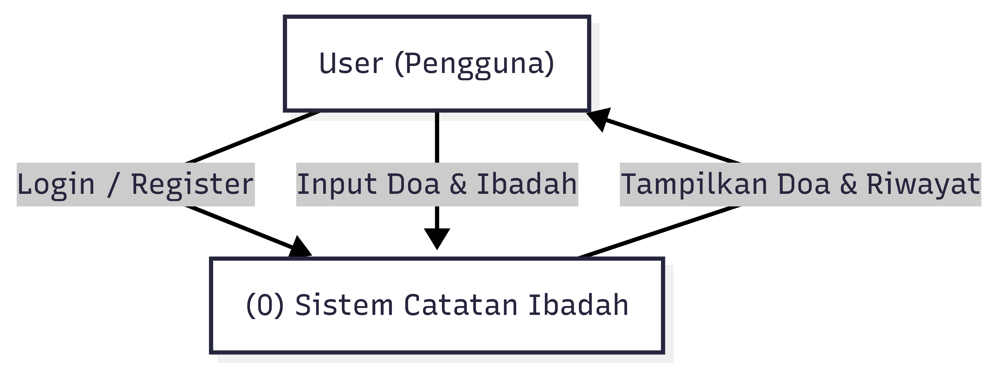
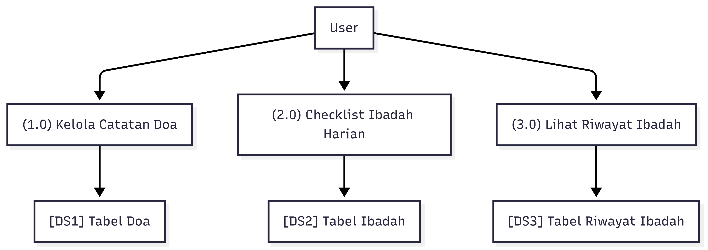
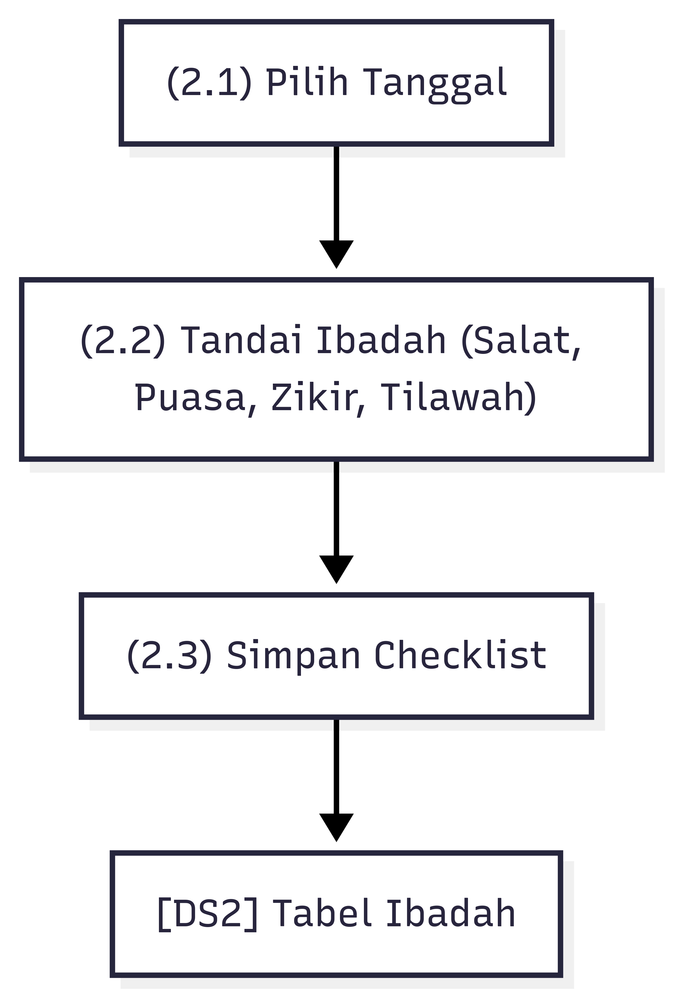
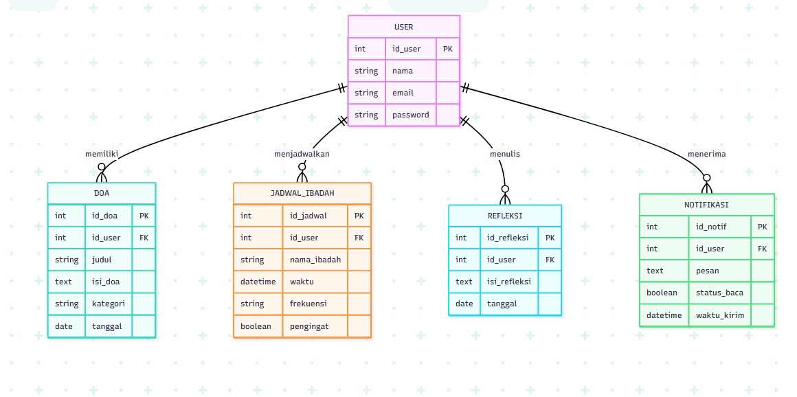

# 🍎 Sistem Catatan Doa & Jadwal Ibadah

## 📌 Latar Belakang Permasalahan
Di era digital saat ini, banyak aktivitas umat beragama dilakukan melalui teknologi, mulai dari membaca kitab suci, mendengarkan ceramah, hingga pengingat ibadah. Namun, tidak sedikit umat yang masih kesulitan dalam:
- Mencatat dan menyimpan doa-doa harian secara terorganisir.
- Menjaga konsistensi ibadah karena tidak ada pengingat rutin.
- Menyusun jadwal ibadah mingguan atau bulanan.
- Menyimpan niat dan doa pribadi agar dapat dibaca kembali.
Kebanyakan aplikasi spiritual hanya fokus pada satu aspek, seperti jadwal salat atau alkitab digital, tanpa menyediakan ruang pribadi untuk mencatat doa, refleksi harian, dan jadwal ibadah yang bisa dikustomisasi.

## 🎯 Tujuan Sistem
Memudahkan pengguna dalam mencatat dan mengelola doa pribadi dan umum.
- Memberikan pengingat jadwal ibadah rutin (misalnya salat, misa, sembahyang).
- Menjadi sarana refleksi spiritual harian yang dapat diakses kapan saja.
- Menyediakan pengalaman spiritual yang lebih personal dan interaktif.

## 👤 Pengguna Utama Sistem

| Role     | Deskripsi Pengguna                                                   |
|----------|----------------------------------------------------------------------|
| **User** | Pengguna individu (personal) yang mencatat dan melacak ibadah harian |

Umat beragama dari berbagai kalangan usia (remaja hingga dewasa) yang ingin mencatat doa, mengatur jadwal ibadah, dan mengevaluasi ibadah secara berkala.
Pengurus komunitas keagamaan yang ingin membagikan jadwal kegiatan ibadah kepada anggotanya.

---

## 📋 Spesifikasi Kebutuhan Sistem

### ✅ Kebutuhan Fungsional
- Registrasi dan login pengguna
- CRUD Catatan Doa (tambah, edit, hapus doa)
- Checklist Ibadah Harian (Salat, Puasa, Zikir, Tilawah)
- Riwayat Ibadah Mingguan/Bulanan
- Filter atau pencarian doa
- Export data ke PDF dan Excel

### ✅ Kebutuhan Non-Fungsional
- Desain responsif untuk mobile dan desktop
- Navigasi mudah digunakan pengguna umum
- Keamanan login menggunakan hash password
- Performa cepat dan ringan

---

## 🔁 Flowchart Sistem

Flowchart ini menggambarkan proses:  
Login ➔ Tambah Doa ➔ Checklist Ibadah ➔ Simpan ➔ Lihat Riwayat

---

## 🔄 Diagram Konteks (DFD Level 0)

DFD Level 0 memperlihatkan aliran data antara pengguna dan sistem. Pengguna bisa mencatat doa, menandai ibadah harian, dan sistem menyimpan serta menampilkan hasilnya dalam bentuk riwayat.

---

## 🔁 DFD Level 1 – Proses Utama

DFD Level 1 menggambarkan tiga proses utama:
1. **(1.0) Kelola Catatan Doa**  
   Pengguna dapat menambah, mengedit, atau menghapus catatan doa.
2. **(2.0) Checklist Ibadah Harian**  
   Pengguna dapat menandai ibadah yang telah dilakukan (Salat, Puasa, Zikir, Tilawah).
3. **(3.0) Lihat Riwayat Ibadah**  
   Sistem menampilkan data ibadah pengguna secara mingguan atau bulanan.

Setiap proses memiliki data store yang terhubung ke tabel database masing-masing.

---

## 🔁 DFD Level 2 – (2.0) Checklist Ibadah Harian

Rincian proses (2.0) Checklist Ibadah:
1. **Pilih Tanggal**  
   Pengguna menentukan tanggal untuk mencatat ibadah.
2. **Tandai Ibadah**  
   Checklist dilakukan untuk salat, puasa, zikir, dan tilawah.
3. **Simpan Checklist**  
   Sistem menyimpan data ke Tabel Ibadah.

Proses ini dilakukan setiap hari dan menjadi dasar untuk pelaporan mingguan atau bulanan.

---

## 📂 Entity Relationship Diagram (ERD)

Tabel utama:
- `users`: menyimpan data login pengguna
- `doa`: menyimpan catatan doa
- `ibadah`: menyimpan catatan checklist ibadah harian
- `riwayat_ibadah`: agregasi laporan harian/mingguan

---

## 🛠️ Teknologi yang Digunakan
- Laravel 10
- Laravel Breeze (auth)
- Tailwind CSS / Bootstrap
- MySQL
- Laravel Excel (export Excel)
- DomPDF (export PDF)

---